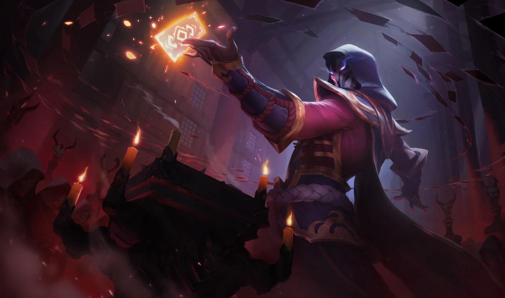

# TwistedFate - An opponent-driven strategy to increase fairness in automated multi-issue negotiations

> _Twisted Fate is an infamous cardsharp and swindler who has gambled and charmed his way across much of the known world, earning the enmity and admiration of the rich and foolish alike. He rarely takes things seriously, greeting each day with a mocking smile and an insouciant swagger. In every possible way, Twisted Fate always has an ace up his sleeve._

In our world (Earth Dimension 616), TwistedFate plays the character of a charming agent who is taking part in the **Multi Agent Systems Rumble Tournament** held by BilgeWater's ruler (Praveen Paruchuri) and its chief in commander (Shreevignesh Suriyanarayanan).
